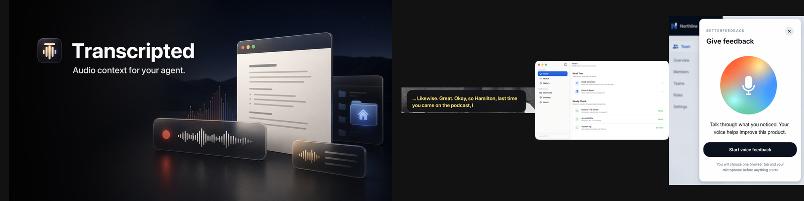
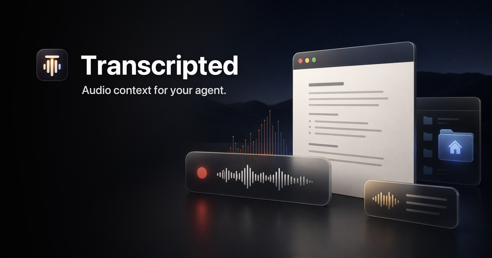

# Hi, I'm Justin

Principal GTM Engineer at [Jamf](https://www.jamf.com/). After hours I build **local-first Mac voice tools** — audio stays on your machine, output is files you own, no accounts.

Local-first: files on disk, not a database you rent.

---

## Start here → [Transcripted](https://github.com/r3dbars/transcripted)

**Meeting capture + dictation → Markdown on your Mac.**

| Proof | |
| --- | --- |
| Site | [transcripted.app](https://transcripted.app) · [Download](https://transcripted.app/download/) |
| GitHub | Stars and releases on the [Transcripted repo](https://github.com/r3dbars/transcripted) · MIT · Apple Silicon |
| Stack | Swift · on-device ASR · speaker ID · plain Markdown output |

---

## Voice tools (same thesis, smaller scope)

| Project | What it does | Notes |
| --- | --- | --- |
| [**Said**](https://github.com/r3dbars/said) | Live captions for anything your Mac plays | Alpha · on-device · no transcript history |
| [**Um**](https://github.com/r3dbars/um) | Real-time filler-word counter in the menu bar | [Releases](https://github.com/r3dbars/um/releases) |
| [**Recite**](https://github.com/r3dbars/recite) | Local TTS — select text, hear it, no cloud voice API | Notarized DMG |

---

## Agent and developer tools

| Project | What it does |
| --- | --- |
| [**Antibody**](https://github.com/r3dbars/antibody) | Flag a failure once — catch it forever (AI evals) |
| [**Nightshift**](https://github.com/r3dbars/nightshift) | Overnight repo scans → ranked morning brief (drafts, not deploys) |
| [**BetterFeedback SDK**](https://github.com/r3dbars/betterfeedback-sdk) | Voice feedback widget → local report on your machine |

[**Unspool**](https://github.com/r3dbars/Unspool) — morning pages as local Markdown. Small utility; not pinned.

---

## What I'm looking for

Open to **senior IC / product-engineering** roles on **Mac, on-device AI, or devtools**.
GTM is the day job; GitHub is the builder proof.

[X / Twitter — @betkerbuilds](https://x.com/betkerbuilds) · [LinkedIn](https://www.linkedin.com/in/justinbetker)
